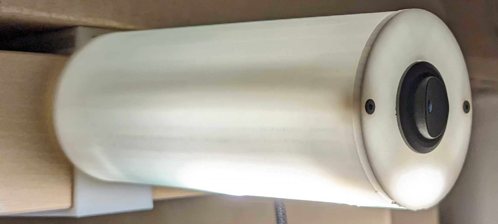
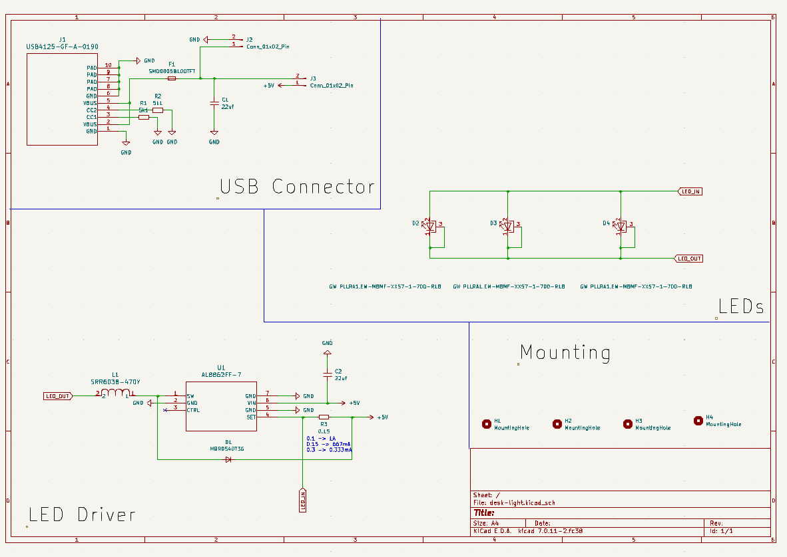
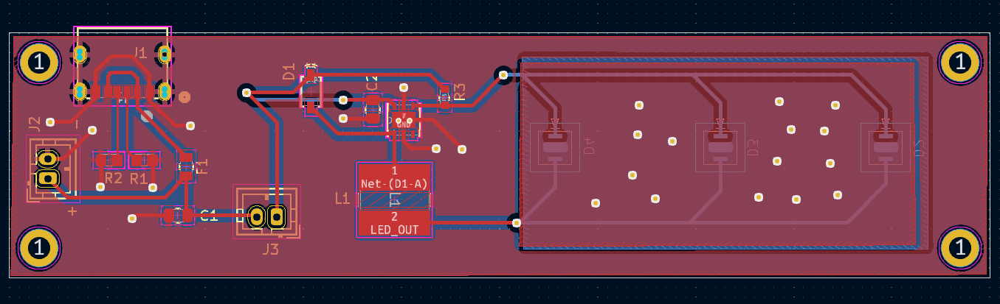

# Desk Light

This is most likely useless for anyone else, hosting it here in case I need to make another one at some point.

## 3D Models

found in `3dPrinting`

## Board

See KiCad files.

### Schematic

### PCB

### BOM

<table>
<tr><td>R1,R2</td><td>5.1k, 0603</td><td></td></tr>
<tr><td>J1</td><td>USB4125-GF-A-0190</td><td>https://uk.farnell.com/global-connector-technology/usb4125-gf-a-0190/usb-conn-type-c-r-a-rcpt-6pos/dp/3777661</td></tr>
<tr><td>J2</td><td>JST PH 2.0 mm</td><td>alternative power, in case no USB connector used</td></tr>
<tr><td>J3</td><td>JST PH 2.0 mm</td><td>On / off switch</td></tr>
<tr><td>C1, C2</td><td>22uf, 0805</td><td></td></tr>
<tr><td>F1</td><td>Fuse 0805, 1A/1.95A</td><td>https://uk.farnell.com/yageo/smd0805b100tft/pptc-reset-fuse-smd-6vdc-0805/dp/4072028?st=smd0805b100tft</td></tr>
<tr><td>D1</td><td>Diode, MBR0540T3G 0.5A, SOD 123</td><td>https://uk.farnell.com/on-semiconductor/mbr0540t3g/diode-schottky-0-5a-40v-sod-123/dp/2101839?st=mbr0540t3g</td></tr>
<tr><td>U1</td><td>Led Driver, AL8862FF-7, 1A</td><td>https://uk.farnell.com/diodes-inc/al8862ff-7/led-dc-dc-driver-buck-u-dfn3030/dp/3946403?st=al8862ff-7</td></tr>
<tr><td>R3</td><td>0.15ohm, 0603</td><td>sets output to 1A</td></tr>
<tr><td>L1</td><td>Inductor, SRR6038-470Y</td><td>https://uk.farnell.com/bourns/srr6038-470y/power-inductor-47uh-0-95a-shielded/dp/2859255?st=srr6038-470y</td></tr>
<tr><td>D2,D3,D4</td><td>LEDs power, GW PLLRA1.EM-M8MF-XX57-1-700-R18</td><td>https://uk.farnell.com/osram-opto-semiconductors/gw-pllra1-em-m8mf-xx57-1-700/led-hb-warm-white-3000k-280lm/dp/3625393?st=gw%20pllra1.em-m8mf-xx57-1-700-r18</td></tr>

</table>